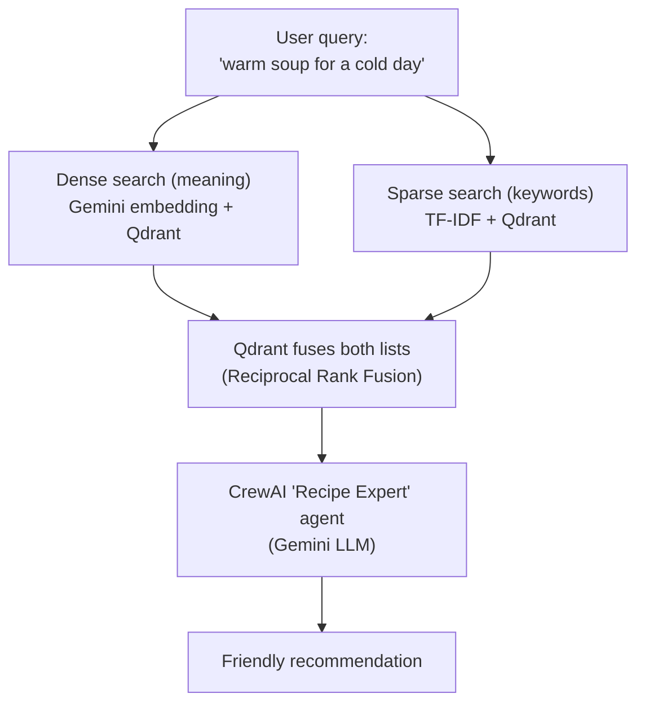

# Hybrid Search RAG: Recipe Recommender

A small, easy-to-read example that shows how to combine **two kinds of search** into one
better search, then use an AI agent to turn the results into a friendly answer.

This is written for developers who are new to AI / RAG concepts. No prior experience with
embeddings, vector databases, or AI agents is assumed.

📖 **Want pictures instead of text?** See the visual walkthrough at
[**docs/index.html**](docs/index.html) (open it in any browser, or view it on
[GitHub Pages](https://exponen-agi.github.io/hybrid-search-rag/) once Pages is enabled for this repo).

## What is "hybrid search"?

Imagine you search for `"warm soup for a cold day"` in a recipe app.

- **Keyword search** only finds recipes that literally contain words like "warm", "soup",
  "cold", "day". It would miss a great recipe called *"Pumpkin Bisque"* even though that's
  exactly what you want, because the words don't match.
- **Semantic search** (AI embeddings) understands *meaning*, so it would find "Pumpkin
  Bisque" too. But it can sometimes miss an exact, important keyword a user typed on purpose
  (like an ingredient name).

**Hybrid search does both at once** and combines the two result lists using a technique
called **Reciprocal Rank Fusion (RRF)**, so you get the best of each approach.



If diagrams don't render for you, here is the same flow in plain text:

```
                    ┌───────────────────────┐
                    │      Your query        │
                    │ "warm soup for winter" │
                    └───────────┬─────────────┘
                                │
                 ┌──────────────┴───────────────┐
                 ▼                               ▼
      ┌─────────────────────┐        ┌─────────────────────┐
      │ Dense (semantic)     │        │ Sparse (keyword)     │
      │ Gemini embedding     │        │ TF-IDF vector        │
      └──────────┬───────────┘        └──────────┬───────────┘
                 │                                │
                 ▼                                ▼
         ┌───────────────────────────────────────────────┐
         │              Qdrant hybrid query                │
         │         (Reciprocal Rank Fusion / RRF)           │
         └───────────────────────┬───────────────────────┘
                                 ▼
                     ┌───────────────────────┐
                     │  CrewAI "Recipe Expert" │
                     │  agent (Gemini LLM)      │
                     └───────────┬─────────────┘
                                 ▼
                    Friendly recipe recommendation
```

## What's in this repo

| File | What it is |
|---|---|
| [`RAG_+_Hybrid_Search_with_Crew_AI,_NeonDb,_Qdrant_and_Gemini_a_real_world_scenario.ipynb`](<RAG_+_Hybrid_Search_with_Crew_AI,_NeonDb,_Qdrant_and_Gemini_a_real_world_scenario.ipynb>) | The full, runnable example notebook |
| [`requirements.txt`](requirements.txt) | Exact, pinned package versions the notebook was tested with |
| [`docs/index.html`](docs/index.html) | A visual, diagram-heavy explanation of the architecture |
| [`LICENSE`](LICENSE) | MIT License |

## The tools this project uses

- **[CrewAI](https://docs.crewai.com/):** Runs an AI "agent" that decides when to search and how to phrase the final answer.
- **[Qdrant](https://qdrant.tech/):** A vector database. Stores both the semantic (dense) and keyword (sparse) vectors for each recipe, and does the hybrid RRF search.
- **[Neon](https://neon.tech/):** A free, serverless PostgreSQL database, used to store the recipe text/metadata itself (name, description, cuisine, season).
- **[langchain-google-genai](https://pypi.org/project/langchain-google-genai/):** Talks to Google's Gemini API to turn recipe text into semantic embeddings (using the `gemini-embedding-2` model — see note below).
- **[scikit-learn](https://scikit-learn.org/):** Provides `TfidfVectorizer`, the classic algorithm used for keyword-based search.
- **[Faker](https://faker.readthedocs.io/):** Generates realistic-looking mock recipes, so you can test the pipeline with anywhere from 5 to 1,000,000 recipes without needing a real dataset.

## Quick start — no accounts, no API keys needed

You can run the whole pipeline end-to-end in a few seconds, entirely offline, to see exactly
how the code works before you sign up for anything:

1. Open the notebook (in [Google Colab](https://colab.research.google.com/github/exponen-agi/hybrid-search-rag/blob/main/RAG_%2B_Hybrid_Search_with_Crew_AI%2C_NeonDb%2C_Qdrant_and_Gemini_a_real_world_scenario.ipynb), Jupyter, or VS Code).
2. Leave `TEST_MODE = True` (this is the default in the config cell).
3. Run all cells top to bottom.

In this mode the notebook:
- Uses an in-memory Qdrant database (no cloud account needed).
- Stores recipes in a plain Python list (no Postgres needed).
- Uses small, deterministic "fake" embeddings instead of calling the Gemini API (no API key, no cost).
- Runs a self-test with real `assert` checks, so you immediately see whether hybrid search is working.

This is the fastest way to confirm the code runs correctly on your machine, and it's exactly
what an automated test/CI run would use too.

## Full experience — with real AI and real cloud databases

Once you're ready to see real, meaningful recommendations (not just fake-vector plumbing
checks), switch to the live pipeline:

### 1. Get your credentials
- A [Google AI Studio](https://aistudio.google.com/app/apikey) API key for Gemini (`GEMINI_API_KEY`).
- A free [Neon](https://neon.tech) PostgreSQL database — you'll need the host, database name, username, and password.
- A free [Qdrant Cloud](https://cloud.qdrant.io) cluster — you'll need the cluster URL and API key.

### 2. Set your environment variables
```bash
export GEMINI_API_KEY="your-gemini-api-key"
export DB_HOST="your-neon-host"
export DB_NAME="your-database-name"
export DB_USER="your-database-user"
export DB_PASSWORD="your-database-password"
export QDRANT_URL="your-qdrant-cluster-url"
export QDRANT_API_KEY="your-qdrant-api-key"
```
(In Colab, you can instead paste these into the notebook's config cell directly, or use
Colab's "Secrets" panel.)

### 3. Install dependencies
```bash
pip install -r requirements.txt
```

### 4. Run the notebook
Open the config cell and change:
```python
TEST_MODE = False
```
Then run all cells. The notebook will:
1. Create the `recipes` table in your Neon database and insert sample data.
2. Create a Qdrant collection with a dense ("semantic-vector") and sparse ("keyword-vector") index.
3. Embed every recipe with Gemini and index it into Qdrant.
4. Ask you what kind of recipe you're looking for.
5. Use hybrid search + a CrewAI agent to recommend a recipe in plain, friendly language.

## Testing at scale (up to 1,000,000 recipes)

The notebook includes an optional cell that uses [Faker](https://faker.readthedocs.io/) to
generate a mock dataset of any size — including a full 1,000,000-recipe test — so you can see
how hybrid search behaves as the dataset grows, without needing a real large dataset or
spending money on embedding API calls. It's off by default; see the notebook's
"Optional: scale test" section for how to turn it on and what to expect (roughly 35–40
minutes and a few GB of RAM for the full 1,000,000-recipe run).

We didn't bundle a real public dataset (like [RecipeNLG](https://recipenlg.cs.put.poznan.pl/)
or the [Food.com Recipes and Interactions](https://www.kaggle.com/datasets/shuyangli94/food-com-recipes-and-user-interactions)
dataset on Kaggle) because they're several gigabytes and carry their own license terms — but
they're worth trying manually if you want to test with real-world recipe text instead of
mock data.

## How the code is organized

1. **Configuration** — one `TEST_MODE` flag switches between the offline demo and the real pipeline.
2. **Embeddings** — `get_embedding_model()` returns either a real Gemini embedding client or a fast, deterministic fake one.
3. **Storage** — `setup_database_and_qdrant()` stores recipe text (Postgres or an in-memory list) and indexes dense + sparse vectors into Qdrant.
4. **Hybrid search** — `hybrid_search()` is the core function: it embeds the query two ways, then asks Qdrant to fuse the results with RRF.
5. **CrewAI agent** — `build_recipe_crew()` wires up a single agent whose only tool is `hybrid_search()`, so it always answers based on real search results.

## Recent dependency & methodology updates (checked 2026-08-27)

This project is checked periodically against upstream release notes so it keeps working and
keeps teaching current best practice, not outdated patterns. Latest pass:

- **Switched the embedding model from `gemini-embedding-001` to `gemini-embedding-2`.**
  Google has `gemini-embedding-001` scheduled for shutdown between July and October 2026, and
  the LangChain Google team's own contributor guide already lists it as a model to avoid.
  `gemini-embedding-2` is the generally-available successor — same default 3072-dimension
  output, so nothing else in the pipeline (Qdrant collection config, `EMBEDDING_DIM`) needed
  to change. If you're on an account that still has `gemini-embedding-001` access and prefer
  it, it's a one-line swap back in the notebook's config cell.
- **Bumped `langchain-google-genai` (4.3.4 → 4.3.6) and `faker` (40.36.0 → 40.37.0)** to their
  latest published patch releases. `crewai`, `crewai-tools`, `qdrant-client`, `scikit-learn`,
  and `psycopg2-binary` were already pinned to their current latest versions.
- **Verified `qdrant-client==1.19.0` still matches this notebook's usage.** That release
  removed several long-deprecated methods (`search`, `recommend`, `upload_records`,
  `recreate_collection`, and others) — this notebook already used the modern
  `collection_exists()` / `create_collection()` / `query_points()` calls, so no code changes
  were required there.
- **Confirmed `gemini/gemini-3.5-flash`** (the CrewAI agent's LLM) is still a current,
  supported Gemini Flash model — no change needed.

## License

This project is licensed under the [MIT License](LICENSE).
